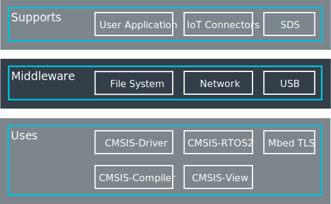

# Overview {#mainpage}

The free-to-use **MDK-Middleware** contains software components for IPv4 and IPv6 networking, USB Host and Device
communication, and file system for data storage. The components can for example be used by the user's application, IoT
connectors for cloud connectivity, or the \urlout{SDS}.

The MDK-Middleware provides following components:

- \url{MW-FileSystem}: create, save, read, and modify files in storage devices such as RAM, Flash, SD/SDHC/MMC memory cards,
  or USB memory devices.
- \url{MW-Network}: services, protocol sockets, and physical communication interfaces for creating networking applications.
- \url{MW-USB}: create USB Device and USB Host applications with standard USB device classes.

Software components or APIs outside the scope of this documentation are:

- \urlout{CMSIS-RTOS2}: the real-time operating system API used by all middleware components (required).
- \urlout{mbedTLS}: provides encryption and secure communication for network components (optional).
- \urlout{CMSIS-Compiler}: simplifies retargeting of the standard C run-time library (optional).
- \urlout{CMSIS-View}: equips software developers with software components, utilities and methodologies that provide
  visibility into internal operation of embedded applications and software components (optional).
- \urlout{CMSIS-Driver}: required \ref DriverInterface "driver interface" for the MDK-Middleware software components  (required).

\note
- Before using MDK-Middleware, please make sure that your selected microcontroller device offers \urlout{CMSIS-Driver} support.
- The middleware components require a \urlout{CMSIS-RTOS2} compliant real-time operating system for task scheduling.
- MDK-Middleware uses software components from the new \urlout{CMSIS-View} and \urlout{CMSIS-Compiler} CMSIS-Packs.

## Access to MDK-Middleware {#mw_access}

MDK-Middleware is actively maintained in the [**MDK-Middleware repository**](https://github.com/ARM-software/MDK-Middleware) and provided as part of the [**MDK-Middleware Software Pack**](https://www.keil.arm.com/packs/mdk-middleware-keil).

## Supported toolchains {#gen_supported_toolchains}

MDK-Middleware components are available as source code and will work with all major toolchains including Arm Compiler 6, GCC and IAR.

## Documentation Structure {#mw_using_mw}

This user's guide contains the following chapters:

- \ref mw_using_generic_steps explains the necessary steps to create from scratch a project containing a Middleware component.
- \ref mw_using_stack_and_heap describes how to configure a project to meet the resource requirements of the Middleware.

Every middleware component has a section on the following topics to explain how to create an application:

- **Create an Application** contains step-by-step instructions for using the components in an embedded application.
- **Example projects** outline key product features of the software components. They are tested, implemented, and proven on several evaluation boards and can be used as a starting point for application development.
- **Resource Requirements** state the stack, thread and memory resource requirements for every component.
- **Reference** documents the files of a component and each API function.

The following table gives you links to the respective sections of each middleware component:

\anchor doc_mw
<table class="doxtable">
  <tr>
    <th>Topic</th>
    <th colspan="5" style="text-align:center;">Links to Documentation</th>
  </tr>
  <tr>
    <td>**Create an Application**</td>
    <td>[**File System**](../FileSystem/create_app.html)</td>
    <td>[**Network**](../Network/create_app.html)</td>
    <td>[**USB Device**](../USB/usbd_create_app.html)</td>
    <td>[**USB Host**](../USB/usbh_create_app.html)</td>
  </tr>
  <tr>
    <td>**Example projects**</td>
    <td>[**File System**](../FileSystem/examples.html)</td>
    <td>[**Network**](../Network/examples.html)</td>
    <td>[**USB Device**](../USB/usbd_examples.html)</td>
    <td>[**USB Host**](../USB/usbh_examples.html)</td>
  </tr>
  <tr>
    <td>**Resource Requirements**</td>
    <td>[**File System**](../FileSystem/resource_requirements.html)</td>
    <td>[**Network**](../Network/resource_requirements.html)</td>
    <td>[**USB Device**](../USB/resource_requirements.html#usbd_res_req)</td>
    <td>[**USB Host**](../USB/resource_requirements.html#usbh_res_req)</td>
  </tr>
  <tr>
    <td>**Reference**</td>
    <td>[**File System**](../FileSystem/modules.html)</td>
    <td>[**Network**](../Network/modules.html)</td>
    <td>[**USB Device**](../USB/group__usbd.html)</td>
    <td>[**USB Host**](../USB/group__usbh.html)</td>
  </tr>
</table>
